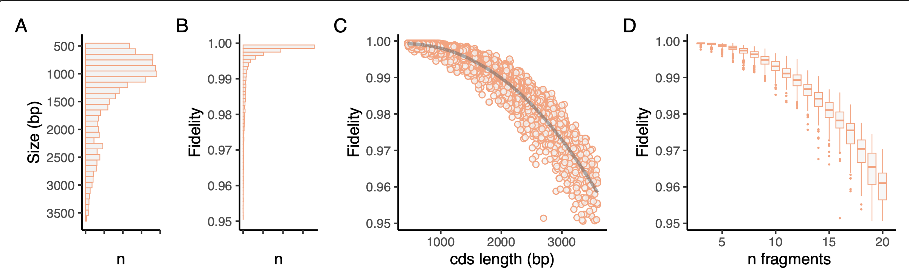

# iggypop
### indexed golden gate assembly of fragments PCR amplified from oligo pools

![[overview.png]]

**`iggypop`** is a pipeline for creating synthetic genes at $3.00  - $7.00 per kB in oligo costs. It uses the Edinburgh Genome Foundry's [dnachisel](https://github.com/Edinburgh-Genome-Foundry/DnaChisel) to optimize sequences and [goldenhinges](https://github.com/Edinburgh-Genome-Foundry/GoldenHinges)to fragment them into barcoded oligos that can be reassembled by golden gate cloning. The  overhangs are selected using pre-computed, high-fidelity `hingesets` and the fragmented genes amplified from oligo pools using experimentally validated `indexsets` primers. Reactions are assembled and cloned into pPOP vectors and then nanopore sequenced using barcoded amplicons and the `iggyseq` pipeline.

## Installation

**Linux

``` bash
#requires python 3.8
git clone github.com/cutlersr/iggypop
cd iggypop
python3.8 -m venv .venv
source .venv/bin/activate
chmod +x setup.sh
./setup.sh
```

**Docker**

``` bash
git clone github.com/cutlersr/iggypop
cd iggypop
docker build -t iggypop .
docker run -it -v $(pwd):/app iggypop
```


### Fragmenting and optimizing coding sequences

```bash
./iggypop.py cds  --i "in/10_TFs.fasta" --o "10_TFs"
```

Coding sequences are domesticated, fragmented, indexed, and appended with cut sites to yield oligonucleotides that can be amplified with gene-specific primers and then assembled. Sequence domestication and optimization is conducted using `dnachisel`; parameters are set in a yaml file using `dnachisel's` built-in [specifications](https://edinburgh-genome-foundry.github.io/DnaChisel/ref/builtin_specifications.html); several yaml files used in our common workflows are in the `/yaml` folder.

You can change most settings on the command line. To codon optimize with an *E. coli* codon table, use BsaI sites for assembly, and synthesize 300 bp oligos:

```bash
./iggypop.py cds                                     \
  --i "test/10_TFs.fasta" --o "10_TFs_coli_mcu"        \
  --base_5p_end "GGTCTCA" --base_3p_end "AGAGACC"    \ # BsaI instead of BsmBI
  --codon_opt "match_codon_usage" --species "e_coli" \ 
  --oligo_length 300		                           # default is 250		 
```

The default `iggypop.py cds` settings designs ORFs that:

-  Lack common Golden Gate cloning sites (BsaI, BsmBI, and BbsI)
-  enforces synonymous changes
- are assembled from oligos ≤ 250 bp that with BsmBI
- are GoldenBraid / MoClo compatible (inner 5'-BsaI-AATG...GCTT-BsaI-3'; see below)

Modify as needed.


### Genbank file mode

The parameters for optimizing GenBank files are different and use annotations added to your GenBank file using [dnachisel's genbank API](https://edinburgh-genome-foundry.github.io/DnaChisel/genbank/genbank_api.html). Adding these annotations is a bit of a pain, but `iggypop format` allows you to do this easily, setting parameters in a yaml file :

```bash
# Format a genbank file using the default domesticate_gb.yml file
./iggypop.py format --i "in/sfGFP_unformatted.gb"  --o "in/sfGFP_formatted.gb"
```

The default settings:

- remove common GG Sites: BsaI, BsmBI, and BbsI using` @AvoidPattern` tags
- protects annotated regulatory sites with `@AvoidChanges` tags; these get added to all of the following annotations in a GenBank record:

    `Promoter, Terminator, Ribosome Binding Site (RBS), Regulatory, Replication Origin (rep_origin), Protein Binding, tRNA, Origin of Transfer (oriT), Stem Loop, or Enhancer`

- enforces synonymous changes to all annotated CDSs using `@EnforceTranslation` tag
- oligos ≤ 250 bp & assembled using BsmBI w/ AATG/GCTT overhangs

We recommend you check the formatting produced by `./iggypop format` in  your favorite viewer. Once everything's good, you can generate your oligos:

```bash
./iggypop.py gb  --i "test/sfGFP_formatted.gb" --o "sfGFP"
```


### GoldenBraid / MoClo compatible CDSs

The default `./iggypop cds` pipeline designs sequences to be reusable with they GoldenBraid and MoClo systems by incorporating 5'-BsaI-AATG  and GCTT-BsaI-3'. The figure above illustrates the mapping between parameters and the CDS ends. You can modify `base_5p_end` and `base_3p_end` parameters as needed. Note that `pcr_5p_cut` and `pcr_3p_cut` define the cut sites that are present on the ends of each oligonucleotide fragment and used for Golden Gate assembly.
![[goldenbraid.png]]


### Two-step assembly

For target sequences longer than 3 kb (~18 fragments w/ 250 bp oligos), the frequency of proper clones is low enough that it is more practical to break the target sequences into smaller fragments that are individually assembled, sequence verified, then used in second step assemblies to yield the final target. 

![[two_step.png]]

To use this mode, use the two_step yaml files provided.
```bash
./iggypop.py cds \
	--i "in/RUBY.fasta" --o "RUBY_two_step" --yml "yaml/two_step_cds.yml"	
```


### Changing your cloning overhangs & assembly enzyme

If you don't want to use the pPOP vectors and/or you want to change the enzyme you use to assemble the oligonucleotides, you can change the external overhangs and enzyme used for cloning:

```bash
./iggypop.py cds --i "test/RUBY.fasta"                 \
	--pcr_5p_cut GGTCTCA  --pcr_3p_cut AGAGACC     \ # BsaI 
	--base_5p_end AAAA    --base_3p_end GCCG       \ # new cloning ends
	--ext_overhangs AAAA GCCG                      \ # update this as well
	
# NB: if running two-step, also modify two_step_3p_end and two_step_5p_end
```


### Combining runs 

When combining different projects into one oligo pool, you can use the `--primer_index` option to specify which row of the `indexset` file to start from for new runs.

```bash
./iggypop.py cds --i "test/edibles.fasta"    --o "edibles"                 
./iggypop.py cds --i "test/juiceables.fasta" --o "juiceables"         \
                 --primer_index 11   # first run was for 10 genes

# combine the files into one fasta file for ordering
cat out/juiceables/juiceables_oligo_pool.fasta                        \
    out/edibles/edibles_oligo_pool.fasta > oligo_order.fasta
```

 To make sure all's well before ordering, you can use `assemble_fragments.py` to simulate assembly of the oligos, confirm that only unique index primers are used in your pool, and confirm that all of oligos for a gene have matching overhangs.
 
```bash
python scripts/assemble_fragments.py   --i "oligo_order.fasta"         \
                                       --o "assembled_ej_oligos.fasta"
# if you are analyzing two step assemblies, change the --n parameter  
```

### Versioning

If you want to generate and test multiple optimized versions of a target;  use the `repeat` option. 
```bash
./iggypop.py cds --i "test/RUBY.fasta" --o "five_RUBYs"           \
				--codon_opt "match_codon_usage" --repeats 5 
```


### Chisel only

`--mode no_hinge`  turns off fragmentation to output only dnachisel'd sequences. 


### Reports

`--reports` turns on dnachisel's report function, which adds a sub-folder to the output folder with  the changes made to each input sequence.


### Quiet mode

`--quiet on` suppresses most output to the terminal.


### Reproducibility

Seeds are randomly generated, but `--seed 123` will force a specific seed (in this case `123`); the log file contains the seeds used for each sequence, if  needed.


## pPOP-vectors

We've developed a series of pPOP vectors for the one-step and two-step cloning modes and for direct plant transformation of assembled sequences; they are derivatives of pUPD2 and pCAMBIA. Sequences can be found [here].


## iggyseq

The `iggyseq` pipeline identifies error-free clones by nanopore sequencing of barcoded colony PCR amplicons. `iggyseq` uses `MiniBar` to demultiplex samples,  `chopper` to remove low-quality reads, and `minimap2` to map reads to reference sequences.  `Samtools`, `bcftools`, `bedtools`, `racon` and `medaka`  are then used to generate consensus sequences and annotate variants. Synonymous mutations for coding sequence inputs are optionally identified using `emboss`. The barcode primers we use were designed using a set of 18-mer primers generated using `./iggypop primers` (see below), which were processed using `barcode_selection.py` to identify a set of 96 maximally different subsets with a an average edit distance of ~10 and minimal edit distance of 8. The barcode and primers that we use with the pPOP vectors are available here: XXX.


### hingesets 

`iggypop` use `goldenhinges` to  identify overhang solutions within a `--radius` of target cut sites, using a precomputed hinges  – `hingesets` – to constrain choices to high-fidelity sets. `iggypop` searches for multiple solutions (`--n_tries`), and returns the highest fidelity set found. Increasing `n_tries` or `radius` can modestly improve fidelity, though it also leads to increased computation time.  

We created `hingesets` using a genetic algorithm optimizer to identify high-fidelity  sets compatible with `AATG` and `GCTT`  overhangs, which have near-perfect fidelity and are compatible used with our pPOP vectors.   `hingesets` fidelities are calculated using [Potapov et al.](https://pubs.acs.org/doi/10.1021/acssynbio.8b00333) data (T4 ligase, 25 ºC, 1 hr); you can change the `potapov_data` parameter to use different scoring data (present in the `data/` folder).

The data below shows the fidelities obtained for `iggypop` runs on 4,500 plant transcription factors using `AATG` and `GCTT` cloning overhangs; the median assembly fidelity is predicted to be 99.5%.


##### custom hingesets

1000s of `iggypop gagga` runs on UCR's high performance computing cluster followed by collation with `process_gagga_runs.R` generated `hingesets.csv`. The `top_percent` scoring overhang of each set size are retained, and then `n_cliques` maximally diverse subsets were selected. Due to the way GAs work, sets with repeated sequences can arise; the `alpha` and `beta` parameters control a penalty function that reduces repeated overhangs. If you'd like to create new sets (for example maximized for compatibility with different cloning overhangs) you can run our pipeline. 
```bash
# one run:
iggypop gagga 
	--set_size=20         --pop_size=1000          \
	--min_improve=.0005   --alpha 2.4              \
	--beta 2.4            --tournament_size 4 

# run a bunch of optimizations w/ different set sizes
# then run this from the directory with all of your results
Rscript scripts/process_gagga_runs.R --top_percent=2 --n_cliques=30
```


### indexsets

The `indexsets` primers were designed to: 

-  have balanced Tms of 60 ºC.
-  lack commonly used restriction sites.
-  minimize primer dimerization.
-  minimize cross-hybridization between index primers.
-  minimize amplification of common contaminating DNAs (*E. coli*, T4, etc).

We designed the indexing primers using `primer3-py` then scored them for potential cross-hybridization/amplification using `MFEprimer-3` ; testing for both cross-binding within the set of  index primers and against potential contaminating DNAs (*E. coli*, T4, T7). The `indexsets` file contains 10K primer pairs; ~350 have been experimentally validated. About 1% of primer sets tested failed and were purged from the `indexsets`.

#### custom indexsets

You probably don't need to start from scratch, but in case you do, here's the pipeline:

```bash
# exmple run settings; set `num_sequences` to more than you need to account for bad primers that are eliminated after the MFEprimer steps.
	./iggypop primers                     \
	--num_sequences 10  --opt_tm 60       \
	--opt_size 18       --gc_content 0.5  \
	--max_size 18       --min_size 18
```


Here's sample `MFEprimer3` output used to extract binding scores, dimers, hairpins, and amplicons; any pair with >1 amplicon, hairpin formation, or dimerization was eliminated; the lowest binding score primers retained. 

![[MFEprimer3_output.png]]
