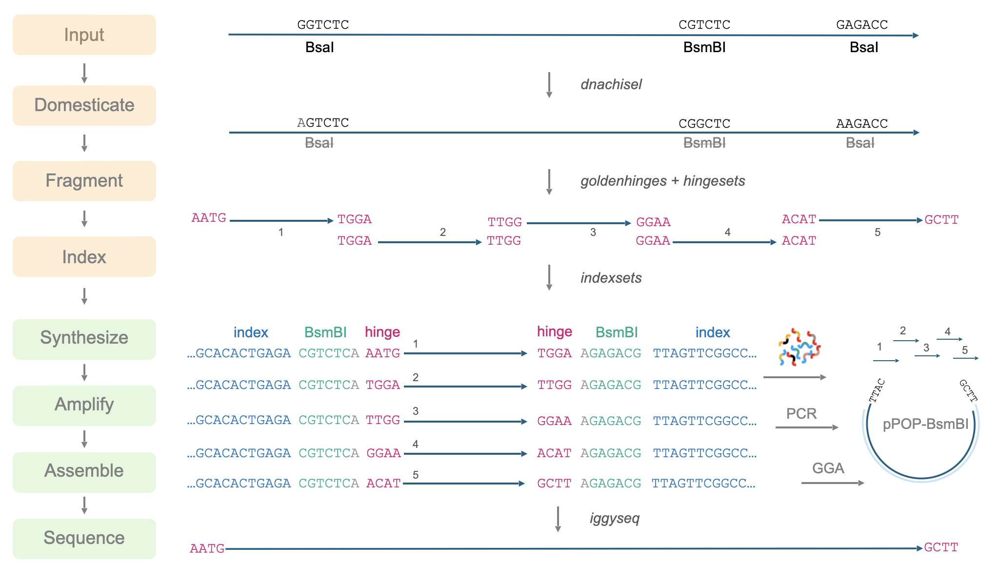

# iggypop
### indexed golden gate DNA assembly by PCRing oligo pool templates

*Foundries for everyone*

**iggypop** is a pipeline for creating synthetic genes at $3.00  - $7.00 per kB in oligo costs. It uses the  Edinburgh Genome Foundry's [dnachisel](https://github.com/Edinburgh-Genome-Foundry/DnaChisel) to optimize sequences and [goldenhinges](https://github.com/Edinburgh-Genome-Foundry/GoldenHinges)to fragment them into barcoded pieces that can be reassembled by golden gate cloning. The assembly overhangs are selected using pre-computed, high-fidelity sets and the fragmented genes are amplified from oligo pools using experimentally validated barcode primer pairs. 

**iggypop enables end-to-end design, assembly, and validation of 100s of genetic parts in a single experiment.**



\We have used iggypop to optimize *E. coli* multi-gene operons, to create a large collection of phylogenetically diverse domesticated, MoClo-compatible plant transcription factors, and to design and optimize new plant reporter gene constructs. About 165 constructs can be built for $1100 in oligo costs, or about $7 per ~1 kb target; this can be reduced to $3 per gene by combing oligos for different projects in the same pool. iggypop's great for big-ish projects, but not cost effective if you only need a few genes synthesized.

1. [Installation](#installation)
2.  [Coding Sequence Mode](#coding-sequence-mode)
	- [options](#options)
3. [Genbank File Mode](#genbank-file-mode)
4. [Customizing Parameters](#customizing-parameters)
5. [Common workflows & tips]()
	1. [MoClo compatible CDSs]()
	2. [Two step assemblies]()
	3. [Tuning by tweaking]()
		1. [multiple barcodes for long fragments]() 
		2. [overkill]()
	4. [Deintronization]()
	5. [No frills CDS domestication]()
	6. [Positive controls]()
6. [Vectors](#vectors)
7. [Other tools](#other-tools)
	- [Barcode primers](#barcode-primers)
	- [Overhang sets](link) 
8. [Usage on the UCR HPCC]()
## Installation

**Linux**
``` bash
git clone github.com/cutlersr/iggypop
cd iggypop
python -m venv .venv
source .venv/bin/activate
chmod +x setup.sh
./setup.sh
```

**Docker**
``` bash
git clone github.com/cutlersr/iggypop
cd iggypop
docker build -t iggypop .
docker run -it -v $(pwd):/app iggypop
```

**Singularity**
``` bash
git clone github.com/cutlersr/iggypop
cd iggypop
singularity build iggypop.sif Singularity
singularity run -B $(pwd):/app iggypop.sif
```


## Usage
### Coding Sequence Mode

```bash
# CDS in FASTA format
python ./iggypop.py cds    \
--i "in/test.fasta"         \
--o "cds_oligos"            \
--yml "yaml/default.yml"    \
```

Coding sequences are first optimized using `dnachisel` and then fragmented using `goldenhinges`. Barcodes and cut sites are then added to each fragment to yield oligos that can be amplified with gene-specific primers and assembled. 

The `dnachisel` parameters for sequence optimization can be conveniently set in a yaml file using `dnachisel` [specifications](https://edinburgh-genome-foundry.github.io/DnaChisel/ref/builtin_specifications.html). For example, to exclude BsaI sites, prevent changes to the first 200 base pairs, and enforce synonymous changes to the coding sequence, you would include the following in your yaml file.
```yaml
constraints
# RE sites to avoid
  - type: AvoidPattern
	pattern: BsaI_site
    strand: both    
    # Prevent changes in the first 200 base pairs
  - type: AvoidChanges
    location: [1, 200]
# Force changes to be synonymous  
  - type: EnforceTranslation
```
The simplest way to change parameters is by modifying [template.yml](https://github.com/cutlersr/iggypop/blob/main/parameters/default.yml), which is well documented and easy to modify; several yaml files used in our common workflows are in the yaml folder.

You can also change settings on the command line. To use `use_best_codon` optimization, an  *E. coli* codon table,  BsaI sites for assemblies, and 300 bp oligos:
```bash
python ./iggypop.py cds             \
  --i "in/cds_test.fasta"           \
  --base_5p_end "CGTCTCA"           \
  --base_3p_end "AGAGACG"           \
  --species "e_coli"                \
  --codon_opt "use_best_codon"      \
  --segment_length 250 #note: oligos need an 50 extra bp for barcodes + cut sites
```

The default cds settings: 

	designs ORFs that:
	- Lack common gg sites (BsaI, BsmBI, BbsI, SapI, BtgZI)
	- Match Arabidopsis codon usage
	- Minimize micro-homologies (10 bp repats) and hairpins
	- hace G/C content ≤ 0.60
	
    & creates oligos that:
	 - are ≤ 250 bp
	- are assembed using BsmBI
	- are MoClo compatible
	- sets a maximum of 6 fragments per PCR reaction
		 i.e. longer genes will get split into 2 or more PCRs

Modify as needed. See the [Common Workflows & Tips]() below for more details.

### Genbank file mode
The paramaters for optimized genbank files are set with annotations according to [dnachisel's genbank API](https://edinburgh-genome-foundry.github.io/DnaChisel/genbank/genbank_api.html). Adding annotations is a bit of a pain, but you can use  `iggypop format` to speed this up.
```bash
# Format a genbank file using the default settings from a yaml
python ./iggypop.py format      \
	--i "in/test_formatted.gb"  \
	--o "test_formatted.gb"     \
	--yml "yaml/gb.yml"
```

The default `gb.yml` formatting: 
- Adds `@AvoidChanges` tags to regions annotated as:
    Promoter, Terminator, Ribosome Binding Site (RBS), Regulatory, Replication Origin (rep_origin), Protein Binding, tRNA, Origin of Transfer (oriT), Stem Loop, or Enhancer
- Codon optimizes annotated CDSs for _E. coli_ with `~match_codon_usage(species=e_coli)`.
- Enforces synonymous changes to annotated CDSs with `@EnforceTranslation`
- Removes Common GG Sites: BsaI, BsmBI, BbsI, SapI, BtgZI using` @AvoidPattern`
- Minimizes micro-homologies (10 bp repeats) with `~UniquifyAllKmers(include_reverse_complement=True,k=10)` 
- Prevents hairpins with `@AvoidHairpins(stem_size=20, hairpin_window=250)`
- Maintains a GC Content ≤ 0.65 with `@EnforceGCContent(maxi=0.6, window=60`

To change optimization parameters, you can update the annotations in the gb file and/or change the yaml used with `iggypop format`:
```
 ### default formatting output for superfolder GFP ###
	 CDS             1659..2372
                     /standard_name="superfolder GFP"
     misc_feature    1659..2372
                     /label="@EnforceTranslation"
     misc_feature    1659..2372
		            /label="~match_codon_usage(species=e_coli)"
```

To change to *S. cerevisiae* codon usage:
```
    misc_feature    1659..2372
                     /label="@EnforceTranslation"
	misc_feature    1659..2372
		            /label="~match_codon_usage(species=s_cerevisiae)"		     
```

To skip codon optimization, but allow other synonymous changes:
```
     misc_feature    1659..2372
                     /label="@EnforceTranslation"
```

To prevent any changes to the sequence:
```
     misc_feature    1659..2372
                     /label="@AvoidChanges"
```

A wealth of sequence optimization options are available through the `dnachisel` [API](https://edinburgh-genome-foundry.github.io/DnaChisel/genbank/genbank_api.html). 

We recommend you check the formatting produced by `iggypop format` in Snapgene, Geneious, Benchling, or your favorite viewer. Once everything's good, generate your oligos:
```bash
iggypop gb  --i "in/test_formatted.gb" --o "test_oligos" 
```

## Common use scenarios

### MoClo compatible CDSs
Our major use of iggypop has been to synthesize phylogenetically diverse plant transcription factors  for a gene discovery project. Our  [workflow]()  assembles fragments directly into a plant transformation vector; however, to make the CDSs reusable, we include an inner 5' BsaI/ATTG  in frame with the CDS's native ATG, and 3' GCTT/BsaI. These make the CDS MoClo compatible (i.e. BsaI digestion creates and ORF with AATG/GCTT overhangs). The figure below zooms in on the first and last oligonucleotides of an assembly to illustrate the mapping between parameters set in the yml file and the designed sequence.

![[molco.png]]

#### Two-step assembly
For target sequences longer than 3 Kb (~18 fragments 250 bp oligos), the frequency of proper assemblies is low enough that it can be better to break the target sequences into smaller "step one" fragments that are cloned, sequence validated, and then used for second step assemblies to yield the final target. A challenge with the two-step approach is that one failed block will ruin the entire second step assembly. Thus, settings with a low failure rate are critical. In our [workflow](), we set the maximum fragment length to 1104 base pairs (six oligos), which in our experience can be assembled with a very low failure rate to yield a high percentage of error-free clones. The figure below shows the first and last oligos of a 2-step assembly. This workflow is designed to generate MoClo-compatible CDSs; there's also a [version]() for `.gb` files that skips the MoClo compatibility.

![[two_step.png]]

#### Tuning by tweaking
```bash
iggypop gb  --i "in/operons.gb" --o "operons" --yml "yaml/gb.yml" --repeats 5
```
Unsurprisingly, we have observed substantial differences in expression/performance for the  same proteins encoded by different codon-optimized sequences. To rapidly test and identify optimal variants, this workflow generates a set of sequences using `match_codon_usage`; subsequent functional screens are used to identify the best performing construct(s). 

For one *E. coli* protein engineering experiment in the lab using a split-T7 system, we required simultaneous positive and negative selections and GFP reporting. The example provided is a 2.4 kB three-gene operon that encodes these elements. In building this system, we had observed that the three genes functioned as expected in isolation, but not when combined into a three gene operon. We were able to improve function by testing different gene orders, but even with that, the selections were not as tight as we needed them to be. To address this, we tweaked. We used default iggypop optimization settings with match_codon_usage to generate a series of constructs that had ~10% pair-wise sequence differences but otherwise matched codon adaptation index (CAI) values. The sequences were assembled, tested in *E. coli*, and a highly improved construct was obtained.

###### Overkill
Given the low per-gene costs, we generally tend toward design overkill, meaning we design and make more constructs than we need to, and accept that a percentage of them will fail. We routinely pick and Nanopore sequence eight randomly chosen colonies. For failed assemblies of high importance, you can screen more colonies and often find at least a few correct assemblies. Some ancillary benefits of my lab's tendencies to tweaking overkill is that the sequence generated generally use different overhangs, and some may show improved assembly efficiency.

#### Deintronization
Sequences ported from into new organisms, or any codon optimized sequence, can sometimes contain cryptic introns that reduce or completely kill expression in a eukaryotic host. In plants, the most famous version of this was with  [GFP working as a reporter](https://www.ncbi.nlm.nih.gov/pmc/articles/PMC20051/); this problem was solved by changing codon usage within a cryptic intron. It's unclear how pervasive this issue is, but concerning because even a weakly processed cryptic intron could reduce target protein levels. We have approached this using splicing predictions and DNAChisel to eliminare candidate splice junctions.  With `iggypop cds --deintronize on`,  a chiseled CDS is generated, passed to a Convolutional Neural Network splicing model from the `Spliceator` project, which you can learn about in this [paper](). Potential intron donor and/or acceptor sites are identified, if any, and are fed into to `dnachisel` and eliminated using `@AvoidPattern`. The cleaned sequence is reanalyzed and the process continues for up to  5 times or until a deintronized CDS is identified. 

#### No frills CDS domestication
This workflow skips the codon optimization, G/C content control, hairpin prevention, and repeat prevention of the other workflows. It generates domesticated MoClo compatible CDSs where the only difference from the input CDS is the absence of BsaI & BsmBI sites. Here's the [paramaters file] for this workflow.
```bash
iggypop cds --i "in/blah.gb" --o "minimal" --yml "yaml/no_frills.yml"
```

## Options

| argument                                 | description                                                                                                                                                                  | default             |
| ---------------------------------------- | ---------------------------------------------------------------------------------------------------------------------------------------------------------------------------- | ------------------- |
| `--yml`                                  | file that defines the restriction enzymes to avoid, codon optimization method, etc; default is `default.yml`.                                                                | `yaml/default.yml`  |
| `--mode`                                 | Choose between `chisel`, `no_mods`, or `no_hinge`; if `no_mods` is selected, the input sequence will be used as-is.                                                          | `chisel`            |
| `--two_step`                             | Enable two-step assemblies.                                                                                                                                                  | `"off"`             |
| `--max_fragments`                        | maximum number of fragments per PCR.                                                                                                                                         | `18`                |
| `--primer_index`                         | Where to start adding primers from the indexing primer set. Useful if you are combining oligos from different runs.                                                          | `1`                 |
| `--segment_length`                       | Maximum segment length. 50 bp are added onto seqments for barcodes and cut sites; `segment_length: 200` used for 250 bp oligos. Use `segment_length: 250` for 300 bp oligos. | `200`               |
| `--ext_overhangs`                        | External overhangs used for cloning.                                                                                                                                         | `"AATG, GCTT"`      |
| `--base_5p_end`                          | Sequence to append to 5' end of the chiseled CDS.                                                                                                                            | `"AATGCGGTCTCTA"`   |
| `--base_3p_end`                          | Sequence to append to 3' end of the chiseled CDS.                                                                                                                            | `"GCTTAGAGACCGCTT"` |
| `--pcr_5p_cut`                           | Cut sequence appended to the 5' end of each oligo for gg cloning of PCR products.                                                                                            | `"CGTCTCA"` (BsaI)  |
| `--pcr_3p_cut`                           | Cut sequence appended to the 3' end of each oligo for gg cloning of PCR products.                                                                                            | `"AGAGACG"` (BsaI)  |
| `--seed`                                 | Sets the seed value used by `dnachisel`; useful to reproduce an older run's results. Seed values are stored in the `log.txt` file.                                           |                     |
| `--repeats`                              | Generate multiple versions of the sequences                                                                                                                                  | `1`                 |
| `--tweak_n`                              |                                                                                                                                                                              |                     |
| --                                       |                                                                                                                                                                              |                     |
| Arguments that only affect `iggypop cds` | these are added as annotations to gb files using iggypop format.                                                                                                             |                     |
| `--codon_opt`                            | codon optimization strategy (`use_best_codon`, `match_codon_usage`, `harmonize_rca` or `hybrid`).                                                                            | `match_codon_usage` |
| `--pct`                                  | Used with hybrid codon optimization; percent sequence divergence from input desired.                                                                                         | `25`                |
| `--original_species`                     | Source codon table to harmonize with, used for harmonize_rca codon optimization.                                                                                             |                     |
| `--codon_tbl`                            | Codon table lookup method. Use "cocoputs" or "kazusa" codon data.                                                                                                            | `cocoputs`          |
| `--species`                              | codon table; NCBI taxIDs accepted + common names for some species ()                                                                                                         | `arabidopsis`       |
| `--species`                              | codon table; NCBI taxIDs accepted + common names for some species ()                                                                                                         | `arabidopsis`       |
| `--deintronize`                          | "on" enables deintronization.                                                                                                                                                | `"off"`<br>         |
|                                          |                                                                                                                                                                              |                     |

## Vectors
We've developed a series of pIGGY vectors for the one-step and two-step cloning modes; they are derivatives of pUPD2 and pCAMBIA. Sequences can be found [here].

## Other tools & explanations
### Barcode primers

Our barcode primers were designed to: have balanced Tms, lack commonly used restriction sites, not dimerize, and be as small as possible (to maximize the sequence per oligo dedicated to the target i.e. to maximize the `--segment_length` parameter). In addition, we wanted to minimize potential cross hybridization of the primers, to prevent mis-amplification and off-target hybridization in complex oligonucleotide pools. We also sought to minimize cross hybridization/amplification of contaminant DNAs (*E. coli*, T7, T4, others). To accomplish this, large set of 18 bp primers were generated with `primer3` ; these were then scored for potential cross-hybridization/amplification and amplification of contaminant DNAs using `MFEprimer-3` (described [here](https://academic.oup.com/nar/article/47/W1/W610/5486745)). The top primers with the lowest cross-hybridization/amplifcation scores were retained and are provided [here](). We've tested many of these pairs in oligo pools and only ~1% failed, so it is fairly reliable; 350 pairs are currently validated. We've purged the pairs we know are bad and will update the primer file as we get more validation. You probably don't need to start from scratch, but in case you do, here's the pipeline...

```bash
# exmple run settings; set `num_sequences` to more than you need to account for # bad primers that are eliminated after the MFEprimer steps.
	iggypop primers       \
	--num_sequences 10    \
	--opt_tm 60           \ 
	--opt_size 18         \
	--gc_content 0.5      \
	--max_size 18         \
	--max_size 18
```

### Overhang sets 

We use the `goldenhinges` packages to select overhangs from chiseled sequences. Given a a sequence and a set number of fragments that you desire, `goldenhinges` searches for solution sets with overhangs within a given radius of target cut sites. `goldenhinges` has an option to limit the overhangs allowable to a user-specified list. So, if you provide `goldenhinges` with a precomputed list of 20 overhangs that have an overall assembly fidelity of 98%, any subset selected from that list will possess at least 98% fidelity (and it's usually much higher for small subsets). To create an efficient pipeline for selecting high-fidelity overhangs, we pre-computed a large number of high-fidelity overhang sets using `iggypop gagga` and passes these as constraints to `goldenhinges`; `iggypop` searches these for `n_tries` solutions, and selects the highest fidelity set obtained.

The overhang sets we use (`ohsets.csv`) were generated using a genetic algorithm optimizer. Since most people will not need to do this, our documentation here is super minimal. The sets were optimized with `AATG, GCTT` as the  `fixed_overhangs` (i.e. external cloning overhangs); they work well with many external overhangs. You'll never do better than the fidelity of the two external overhangs. AATG and GCTT have near perfect fidelity and are MoClo compliant for CDSs, so it's easy to create high fidelity sets using these. We built our vectors and workflows around these and design internal sites when we want to do secondary cloning after the initial assembly. The fidelities were calculated using [Potapov et al.](https://pubs.acs.org/doi/10.1021/acssynbio.8b00333) data for one hour incubations at 25 ºC using T4 DNA ligase; you can change this with the `potapov_data` setting. You can specify whatever external overhangs you want, but check with NEB's  [fidelity calculator](https://ligasefidelity.neb.com/viewset/run.cgi) to make sure they are a high-fidelity pair first.

To create the overhang sets we use, we ran a few 1000 gagga runs on UCR's high performance computing cluster for a range of set sizes, and processed the results with `process_gagga_runs.R`. To select the final sets, all of the data is assembled, the `top_percent` scoring overhang of each set size are retained, and then `n_cliques` maximally diverse subsets are selected using [Ashton's MaxMin algorithm](https://onlinelibrary.wiley.com/doi/abs/10.1002/qsar.200290002) (borrowed from chemical informatics, it is simple and iteratively selects members that are maximally different from the selected members of an overhang set).

The following command will do a run with a target of a set of 20 overhangs. Due to the way GAs work, sets with repeated sequences can arise; the `alpha` and `beta` parameters below control a penalty function that reduces repeated overhangs. 
```bash
# run a bunch of optimizations
iggypop gagga 
	--set_size=20            \
	--ngen=150               \
	--pop_size=1000          \
	--min_improve=.0005      \
	--alpha 2.4              \
	--beta 2.4               \
	--tournament_size 4 

# then run this from the directory with all of your results
Rscript scripts/process_gagga_runs.R --top_percent=2 --n_cliques=30
```
The data below shows the fidelities obtained for a run of 4,500 plant transcription factors using AATG/GCTT cloning overhangs; in this run the mean fragment number is 7 (~1.2 kB) and the mean assembly fidelity is predicted to be 99.5%.

