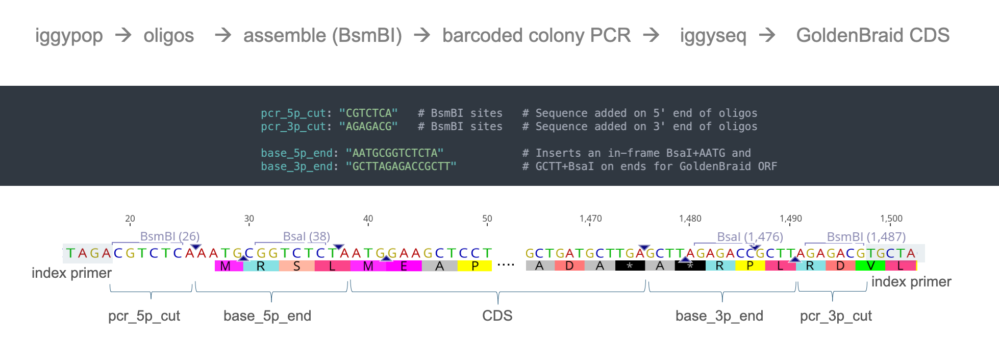
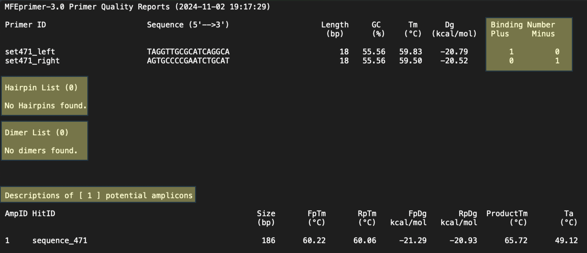

iggypop
========

Facile Gene Synthesis from Oligo Pools
--------------------------------------

.. image:: png/overview.png

**iggypop** is a pipeline for designing and synthesizing genes at a low cost (~$3.00 per kb). It uses Edinburgh Genome Foundry's `dnachisel <https://github.com/Edinburgh-Genome-Foundry/DnaChisel>`_ for sequence optimization and `goldenhinges <https://github.com/Edinburgh-Genome-Foundry/GoldenHinges>`_ for fragmentation into indexed oligos, which are reassembled by Golden Gate cloning. Sequence-verified constructs are identified by nanopore sequencing of barcoded amplicons.

*iggypop* enables economical design, assembly, and validation of hundreds of genetic parts within a week.

Installation
------------

### Linux Installation

.. code-block:: bash

    # Requires Python 3.8
    git clone github.com/cutlersr/iggypop
    cd iggypop
    python3.8 -m venv .venv
    source .venv/bin/activate
    chmod +x setup.sh
    ./setup.sh

### Docker Installation

.. code-block:: bash

    git clone github.com/cutlersr/iggypop
    cd iggypop
    docker build -t iggypop .
    docker run -it -v $(pwd):/app iggypop

Fragmenting and Optimizing Coding Sequences
-------------------------------------------

Coding sequences are domesticated, fragmented, and appended with cut sites to yield oligonucleotides that can be amplified with gene-specific primers and then assembled. Sequence domestication and optimization are conducted using `dnachisel`; optimization parameters can be set in a YAML file using dnachisel's `specifications <https://edinburgh-genome-foundry.github.io/DnaChisel/ref/builtin_specifications.html>`_. Example YAML files are available in the `/yaml` folder.

.. code-block:: bash

    ./iggypop.py cds --i "test/10_TFs.fasta" --o "10_TFs"

Modify parameters by creating new YAML files or using command-line options. To codon optimize with an *E. coli* codon table, use BsaI sites for assembly, and synthesize 300 bp oligos:

.. code-block:: bash

    ./iggypop.py cds                                        \
        --i "test/10_TFs.fasta" --o "10_TFs_coli_mcu"       \
        --base_5p_end "GGTCTCA" --base_3p_end "AGAGACC"     \ # BsaI instead of BsmBI
        --codon_opt "match_codon_usage" --species "e_coli"  \
        --oligo_length 300  # Default is 250

Default coding sequence (CDS) settings:

- Removes common Golden Gate sites (BsaI, BsmBI, BbsI, SapI, BtgZI)
- Enforces synonymous changes
- Designs oligos ≤250 bp for BsmBI assembly
- Lacks hairpins or repeats >12 bp
- Is GoldenBraid / MoClo compatible (inner 5'-BsaI-AATG...GCTT-BsaI-3')

GenBank File Mode
-----------------

The parameters for optimizing GenBank files differ and use annotations added to your GenBank file using `dnachisel's genbank API <https://edinburgh-genome-foundry.github.io/DnaChisel/genbank/genbank_api.html>`_. *iggypop.py format* allows easy parameter setting in a YAML file:

.. code-block:: bash

    # Format a GenBank file using the default domesticate_gb.yml file
    ./iggypop.py format --i "test/sfGFP_unformatted.gb" --o "test/sfGFP_formatted.gb"

Default GenBank settings:

- Removes common GG Sites (BsaI, BsmBI, BbsI, SapI, and BtgZI) using `@AvoidPattern` tags
- Protects annotated regulatory sites with `@AvoidChanges` tags
- Enforces synonymous changes to all annotated CDSs using `@EnforceTranslation` tags
- Designs oligos ≤250 bp for BsmBI assembly with AATG/GCTT overhangs

Verify in your favorite viewer, then generate oligos:

.. code-block:: bash

    ./iggypop.py gb --i "test/sfGFP_formatted.gb" --o "sfGFP"

GoldenBraid / MoClo Compatible CDSs
-----------------------------------

The default settings create GoldenBraid/MoClo-compatible level 0 coding sequences with 5'-BsaI-AATG and GCTT-BsaI-3'. Adjust *base_5p_end* and *base_3p_end* parameters to modify this behavior.

Two-Step Assembly
-----------------

For sequences >3 kb (~18 fragments with 250 bp oligos), use two-step assembly mode.

.. image:: png/two_step.png

Use the provided `two_step` YAML files:

.. code-block:: bash

    ./iggypop.py cds --i "test/RUBY.fasta" --o "RUBY_two_step" --yml "yaml/domesticate_two_step_cds.yml"

Changing Cloning Overhangs & Assembly Enzyme
--------------------------------------------

Adjust external overhangs and assembly enzyme:

.. code-block:: bash

    ./iggypop.py cds --i "test/RUBY.fasta"          \
        --pcr_5p_cut GGTCTCA  --pcr_3p_cut AGAGACC  \ # BsaI
        --base_5p_end AAAA    --base_3p_end GCCG    \ # New cloning ends
        --ext_overhangs AAAA GCCG

Combining Runs
--------------

Use "--primer_index" to specify the starting row of the index set for new runs.

.. code-block:: bash

    ./iggypop.py cds --i "test/edibles.fasta" --o "edibles"
    ./iggypop.py cds --i "test/juiceables.fasta" --o "juiceables" --primer_index 11

Combine files into one FASTA file for ordering:

.. code-block:: bash

    cat out/juiceables/juiceables_oligo_pool.fasta \
        out/edibles/edibles_oligo_pool.fasta > oligo_order.fasta

Use `assemble_fragments.py` to simulate oligo assembly and confirm unique index usage:

.. code-block:: bash

    python scripts/assemble_fragments.py --i "oligo_order.fasta" --o "assembled_ej_oligos.fasta"

Versioning
----------

Use the "repeat" option for multiple optimized versions:

.. code-block:: bash

    ./iggypop.py cds --i "test/RUBY.fasta" --o "five_RUBYs" --codon_opt "match_codon_usage" --repeats 5

Reports
-------

Enable dnachisel's report function with "--reports" to create a sub-folder with sequence changes.

Quiet Mode
----------

Use "--quiet on" to suppress most terminal output.

Reproducibility
---------------

Set "--seed 123" to ensure reproducibility.

Vectors
-------

The pPOP `vectors <../vectors/>`_ support one-step and two-step cloning of level 0 parts. The pPlantPOP-BsmBI vector supports iggypop assemblies of MoClo-compatible parts for in planta testing via Agrobacterium-mediated transformation.

iggyseq
-------

*iggyseq* identifies error-free clones via nanopore sequencing of barcoded colony PCR amplicons. See documentation for details.

hingesets
---------

*iggypop* uses *goldenhinges* to identify overhang solutions with precomputed hinge sets.

.. image:: png/fidelity_plot.png

Custom hingesets
----------------

Generate custom hingesets using *gagga*:

.. code-block:: bash

    ./iggypop.py gagga                   \
        --set_size=20 --pop_size=1000    \
        --min_improve=.0005 --alpha 2.4  \
        --beta 2.4 --tournament_size 4

Process multiple runs with `process_gagga_runs.R`:

.. code-block:: bash

    Rscript scripts/process_gagga_runs.R --top_percent=2 --n_cliques=30

indexsets
---------

Our primers, designed to minimize cross-hybridization and unwanted amplifications, support amplifying fragments from pools.

Custom indexsets
----------------

Generate custom index sets:

.. code-block:: bash

    ./iggypop.py primers                   \
        --num_sequences 10 --opt_tm 60  \
        --opt_size 18 --gc_content 0.5  \
        --max_size 18 --min_size 18

Example MFEprimer3 output for primer scoring:

