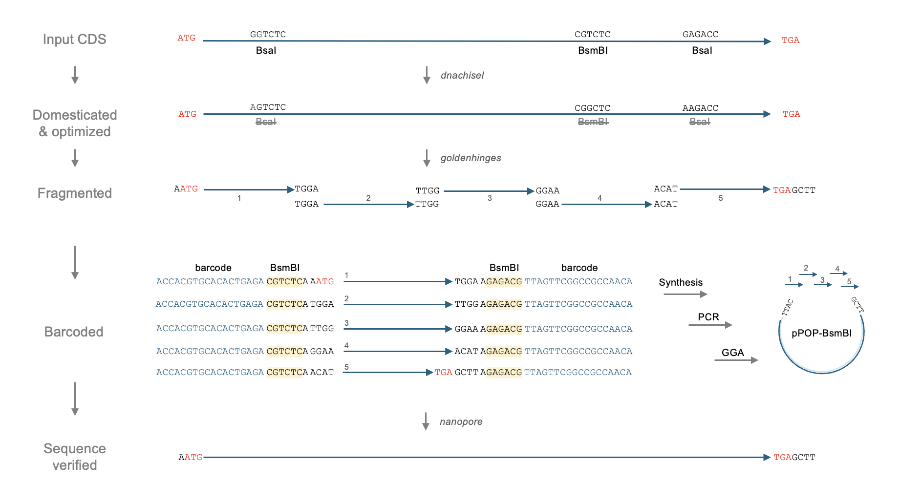
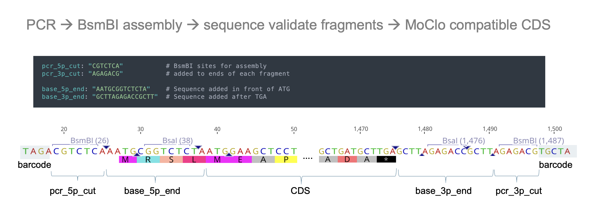
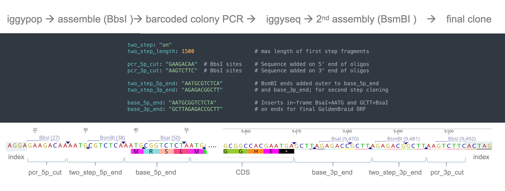
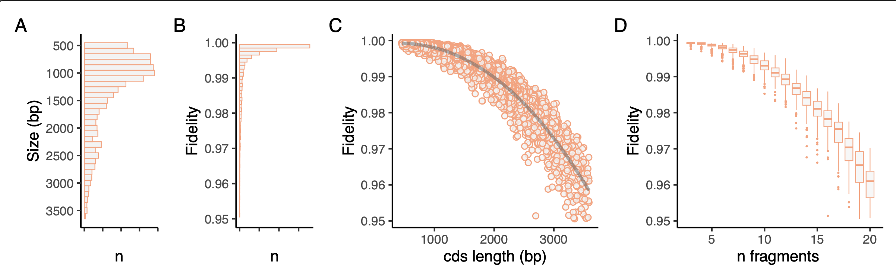

==========================
iggypop
==========================

**indexed golden gate assembly by PCRing barcoded oligo pools**
==========================

iggypop is a pipeline for creating synthetic genes at $3.00 - $7.00 per Kb in oligo costs. It uses the Edinburgh Genome Foundry's `dnachisel <https://github.com/Edinburgh-Genome-Foundry/DnaChisel>`_ to optimize sequences and `goldenhinges <https://github.com/Edinburgh-Genome-Foundry/GoldenHinges>`_ to fragment them into barcoded pieces that can be reassembled by golden gate assembly. High-fidelity assembly overhangs are rapidly selected from pre-computed sets, and the fragmented genes are amplified from oligo pools using experimentally validated barcode primer pairs.

iggypop enables end-to-end design, assembly, and validation of 100s of genetic parts in a single experiment.

Installation
============

**Linux**

.. code:: bash

    git clone github.com/cutlersr/iggypop
    cd iggypop
    python -m venv .venv
    source .venv/bin/activate
    chmod +x setup.sh
    sudo ./setup.sh

**Docker**

.. code:: bash

    git clone github.com/cutlersr/iggypop
    cd iggypop
    docker build -t iggypop .
    docker run -v $(pwd):/app -it iggypop /bin/bash

Usage
=====

Coding Sequence Mode
---------------------

CDS mode is used to design oligos for reassembling coding sequences. It requires fasta formatted ORFs. The default `yaml parameters <https://github.com/cutlersr/iggypop/blob/main/yaml/moclo_cds_mcu.yml>` design MoClo compatible ORFs that lack common gg sites (BsaI, BsmBI, BbsI, SapI, BtgZI), match Arabidopsis codon usage, minimize micro-homologies (10 bp repeats) and hairpins, have G/C content ≤ 0.60.

.. code:: bash

    # CDS in FASTA format
    ./iggypop.py cds --i in/test.fasta --o test_oligos

Sequence optimization parameters are set in yaml files using `dnachisel` `specifications <https://edinburgh-genome-foundry.github.io/DnaChisel/ref/builtin_specifications.html>`_. The following yaml snippet excludes BsaI sites, prevent changes to the first 200 base pairs of the sequencs, and enforces synonymous changes to the coding sequence:

.. code:: yaml

    constraints
        # RE sites to avoid
          - type: AvoidPattern
            pattern: BsaI_site
            strand: both    
        # Prevent changes in the first 200 base pairs
          - type: AvoidChanges
            location: [1, 200]
        # Force changes to be synonymous  
          - type: EnforceTranslation

You can also change settings on the command line. This will use `use_best_codon` optimization, an *S. cerevisiea* codon table, BsaI sites for assemblies, and 300 bp oligos:

.. code:: bash

    ./iggypop.py cds  --i in/cds_test.fasta  --species s_cerevisiea    \
                      --base_3p_end AGAGACG  --base_5p_end CGTCTCA     \
                      --codon_opt use_best_codon  --oligo_length 300

Command line arguments override the paramaters set in the yaml file.

Genbank File Mode
------------------

The parameters for optimized GenBank files are set with annotations according to `dnachisel's genbank API <https://edinburgh-genome-foundry.github.io/DnaChisel/genbank/genbank_api.html>`_. Adding annotations is a bit of a pain, but you can use `iggypop format` to speed this up; the optimization parameters are specified in a yaml file; once formatted you can run with `iggypop.py gb`

.. code:: bash

    # Format a Genbank file 
    
    ./iggypop.py format --i in/test_unformatted.gb    \
                        --o in/test_formatted.gb      \
       # optionally override the defaults             \
                        --species b_subtilis          \
                        --codon_opt use_best_codon    
    					
    
    # Then run the formatted Genbank file to generate oligos
    ./iggypop.py gb  --i in/test_formatted.gb --o test_oligos

We recommend you check the formatting produced by `iggypop format` in Snapgene, Geneious, Benchling, or your favorite viewer.

Design
=====

The yaml/ `folder <yaml/>`_ contains parameter files for some common design strategies. 

 

MoClo-compatible CDSs
-----------------------

The `moclo` yaml files have paramaters to design reusable CDSs by adding a short 5' BsaI/ATTG on the 5' end and a 3' GCTT/BsaI. The CDSs are first assembled with BsmBI and the final clones are MoClo compatible (i.e., BsaI digestion will release an ORF with AATG/GCTT overhangs). The figure below zooms in on the first and last oligonucleotides of an assembly to illustrate the mapping between parameters set in the yml file and the designed sequence. This is the default design mode; see the yaml folder for other options. 

Two-step assembly
-------------------

For target sequences longer than 3 Kb (~16-18 fragments encoded in 250 bp oligos), the frequency of proper assemblies is low enough that it can be more efficient to break the target sequences into smaller step one fragments that are cloned, sequence validated and then used for second step assemblies to yield the final target. The `two_step` yaml files have parameters to break a sequence into ~ 1 Kb chunks assembled and cloned with BbsI; the fragments are then assembled into the final sequence using BsmBI in the second step. You can change the enzymes used and fragment size in the yaml file if needed. The figure below shows the first and last oligos of a 2-step assembly. The CDS mode is designed to generate MoClo-compatible CDSs; the gb versions skips the MoClo compatibility.

.. code:: bash

    ./iggypop.py gb --i in/test.gb --two_step on  --o two_step

Versioning
---------------------

Given the low cost of oligos per gene, you may want to test different versions of the same coding sequence (there is substantial variation in expresion between codon optimized of the same amino acid sequence. The `--repeats` parameter allows you to genrate multiple versions. This example generates five versions of a three gene operon with each ORF being optimized using using match_codon_usage. 

.. code:: bash

    ./iggypop.py gb --i in/test.gb --repeats 5 --o repeats

Deintronization
-----------------

Sequences ported from other organisms or newly designed sequences sometimes contain cryptic introns that reduce or kill expression in a eukaryotic host. With `iggypop cds --deintronize on`, a chiseled CDS is generated and passed to a Convolutional Neural Network splicing model from the `Spliceator` `project <https://link.springer.com/article/10.1007/s00438-016-1258-6>`_. Potential intron donor and acceptor sites are identified, if any, and fed back to `dnachisel` and eliminated using `@AvoidPattern`. The cleaned sequence is reanalyzed and continues up to 5 times or until a deintronized CDS is identified.

.. code:: bash

    ./iggypop.py cds  --i in/test.fasta --deintronize on --o deintronized

`Hybrid` codon optimization
-----------------

The two main methods of optimizing seqeunces are match_codon_usage (MCU) which randomly samples codons based on their usage frequency, and use_best_codon (UBC). MCU generates sequences that typically have CAI values of ~0.75 and UBC generates CAI values of 1. In some cases you may want CAI values in between those ranges, for example if you want to create many versions of high CAI sequences (UBC usually generates only 1 sequence). The --codon_opt  hybrid parameter allows this with the `--pct` paramater determining the target sequence difference from the input sequence (the default values shoot for ~20% difference). You may need to tweak the pct paramater to hit the CAI value you're looking for. This is a bit oif a hack based on this comment at the DNAChisel repo. 

.. code:: bash

    ./iggypop.py cds --i in/test.fasta --codon_opt hybrid --pct 30 --o hybrid

Codon tables
=====

For cds mode, a condensed local version of the [cocoputs](https://pubmed.ncbi.nlm.nih.gov/31029701/) database is used for codon table lookups. For gb mode, the species is specified in the annotation passed to dnachisel, which uses Kazusa codon tables. Based on our lab's most common use cases **cds mode defaults to an arabidopsis codon table and gb mode defaults to an *E.coli* codon table**. To change this use the `--species flag`; TaxIDs or condensed names will work  for cds mode; except for a small number of common short names, TaxIDs are required for gb mode. 

For the monkeyflower *Erythranthe guttata* you could:

.. code:: bash

	# short name, species name, or taxid work cds mode
	./iggypop.py cds  --i in/test.fasta --species e_guttata
	./iggypop.py cds  --i in/test.fasta --species Erythranthe guttata	
	./iggypop.py cds  --i in/test.fasta --species 4155
	
	# taxid requried for gb mode	
	./iggypop.py gb  --i in/test.gb --species 4155
	
	# these work in gb: 

Reports & quiet
-----------------

You can generate dnachisel report with --reports; if you want iggypop to print less to the screen use --quiet

Vectors
=======

We've developed a series of pPOP vectors for the one-step and two-step cloning modes; they are derivatives of pUPD2 and pCAMBIA. Sequences can be found `here <#vectors>`_.

Barcode primers
----------------

Our barcode primers were designed to have balanced Tms, lack commonly used restriction sites, not dimerize, and be as small as possible (to maximize the sequence per oligo dedicated to the target, i.e., to maximize the `--segment_length` parameter). In addition, we wanted to minimize potential cross-hybridization of the primers to prevent mis-amplification and off-target hybridization in complex oligonucleotide pools. We also sought to reduce cross-hybridization/amplification of contaminant DNAs (*E. coli*, T7, T4, others). To accomplish this, a large set of 18 bp primers was generated with `primer3`; these were then scored for potential cross-hybridization/amplification and amplification of contaminant DNAs using `MFEprimer3 <https://academic.oup.com/nar/article/47/W1/W610/5486745>`_. The top primers with the lowest cross-hybridization/amplification scores were retained and are provided `here <#barcode-primers>`_. We've tested many of these pairs in oligo pools, and only ~1% failed, so it is pretty reliable; 350 pairs are currently validated. We've purged the pairs we know are defective and will update the primer file as we get more validation. You probably don't need to start from scratch, but if you do, here's the pipeline...

.. code:: bash

    # example run settings; set `num_sequences` to more than you need to account for # bad primers eliminated after the MFEprimer steps.
    ./iggypop.py primers  --num_sequences 10    \
    --opt_tm 60  --opt_size 18 --gc_content 0.5 \
    --max_size 18 --max_size 18

Overhangs
-------------

We use the `goldenhinges` packages to select overhangs for reassembling chiseled sequences. Given a sequence and fragment sizes, `golden hinges` searches for overhang solutions within a given distance from ideal target cut sites. `golden hinges` can limit the overhangs allowable to a user-specified list. So, if you provide `goldenhinges` with a pre-computed list of 20 overhangs with an overall assembly fidelity of 98%, any subset selected from that list will possess at least 98% fidelity (usually much higher for small subsets). To create an efficient pipeline for selecting high-fidelity overhangs, we pre-computed a large number of high-fidelity overhang sets using `iggypop.py gagga`; these are passed as constraints to `goldenhinges`. `iggypop` searches through these to identify `n_tries` solutions, and returns the highest fidelity set obtained.

The overhang sets we use (`ohsets.csv`) were generated using a genetic algorithm and a Monte Carlo optimizer. The sets were optimized with `AATG, GCTT` as the `fixed_overhangs` (i.e., external cloning overhangs); AATG and GCTT have near-perfect fidelity and are MoClo-compliant for CDSs, so it's easy to create high-fidelity sets using them. Fidelities are calculated using `Potapov et al. <https://pubs.acs.org/doi/10.1021/acssynbio.8b00333>`_ data for one-hour incubations at 25 ºC using T4 DNA ligase; you can change this with the `potapov_data` setting. You can specify whatever external overhangs you want but check with NEB's `fidelity calculator <https://ligasefidelity.neb.com/viewset/run.cgi>`_ to ensure they are a high-fidelity pair first.

For the overhang sets used, we ran a few thousand gaga runs on UCR's high-performance computing cluster and filtered the results to select the highest-scoring sets and maximally diverse subsets.

The following command will do a run with a target of a set of 20 overhangs. Due to the way GAs work, sets with repeated sequences can arise; the `alpha` and `beta` parameters below control a penalty function that reduces repeated overhangs.

.. code:: bash

    # run a bunch of optimizations
    /iggypop.py gagga 
        --set_size=20            \
        --ngen=150               \
        --pop_size=1000          \
        --min_improve=.0005      \
        --alpha 2.4              \
        --beta 2.4               \
        --tournament_size 4 
    
    # then run this from the directory with all of your results
    Rscript scripts/process_gagga_runs.R --top_percent=2 --n_cliques=30

The data below shows the fidelities obtained for a run of 4,500 plant transcription factors using AATG/GCTT cloning overhangs; in this run the mean fragment number is 7 (~1.2 kB) and the mean assembly fidelity is predicted to be 99.5%.

.
